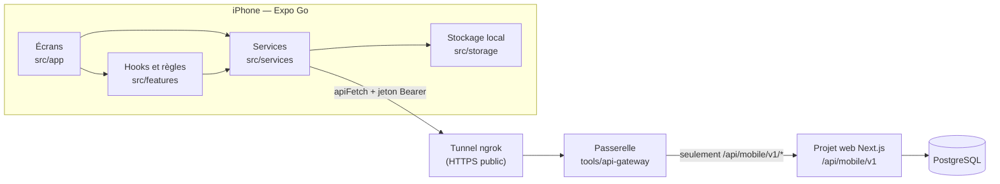

# Architecture

Ce document explique comment l'application est organisée : les routes Expo
Router, les couches du code, et le chemin que suit une action. Il correspond à
la ligne « Architecture React Native / Expo Router » du barème.

Documents liés : [parcours mobile](parcours-mobile.md) ·
[backend et sécurité](backend-et-securite.md) ·
[interface et états](interface-et-etats.md).

## Vue d'ensemble

L'application est un projet Expo (SDK 57, React Native 0.86) écrit en
TypeScript. Elle n'a pas de backend à elle : elle appelle l'API
`/api/mobile/v1` du projet web Repère (Next.js), qui lit et écrit dans
PostgreSQL.



## La règle que je suis

Le sujet l'impose : **un écran ne contient pas toute la logique**. J'ai donc
séparé le code en dossiers qui ont chacun un seul rôle.

| Dossier           | Rôle                                                                 | Ce qu'on n'y trouve pas                    |
| ----------------- | -------------------------------------------------------------------- | ------------------------------------------ |
| `src/app/`        | Les routes : lire les paramètres, brancher hooks et services, composer l'écran, afficher ses états | Ni `fetch`, ni règle métier longue, ni accès direct au stockage |
| `src/features/`   | La logique par domaine : règles en fonctions pures (testées) et hooks qui les branchent | Pas de JSX d'écran                |
| `src/services/`   | L'accès à l'API : un client unique et un fichier par ressource       | Pas de composant, pas d'état               |
| `src/storage/`    | La persistance locale : le jeton, le cache des données               |                                            |
| `src/components/` | Les composants d'affichage                                           | Aucun appel réseau                         |
| `src/theme/`, `src/types/`, `src/utils/` | Couleurs, types de l'API, mise en forme       |                                            |

Vérifiable dans le code : le seul appel à `fetch` de toute l'application est
dans `src/services/api.ts`.

```
src/
  app/                        routes Expo Router
    _layout.tsx               fournisseurs, écran de démarrage, garde connecté / non connecté
    (auth)/                   index (connexion), register (inscription)
    (app)/
      _layout.tsx             bandeau hors ligne + pile de navigation
      (tabs)/                 index (Accueil), book (Réserver), history (Historique), profile (Profil)
      reservation/[id].tsx    détail d'une réservation : arrivée, annulation
      space/[id].tsx          page d'un espace : calendrier et heures
      check-in/[id].tsx       détail d'une tentative d'arrivée
      reserve.tsx             « Réserver près de moi » (fenêtre modale)
      new-reservation.tsx     nouvelle réservation en deux étapes (fenêtre modale)
      scan-space.tsx          scan du QR code d'un espace
      profile-edit.tsx        modifier son profil
      security.tsx            changer e-mail et mot de passe
  features/
    auth/                     AuthContext, verrou de l'écran Sécurité, prénom / nom
    booking/                  calendrier, créneaux, formulaire de réservation
    checkins/                 lecture du QR code, regroupement de l'historique
    feedback/                 toasts, tirer pour rafraîchir
    home/                     tableau de bord de l'accueil
    location/                 position et permission de localisation
    reservations/             règles et liste des réservations
    spaces/                   recherche, carte
  services/                   api.ts (client), ApiError, un service par ressource
  storage/                    token.ts (SecureStore), queryClient.ts (cache)
  components/                 composants d'affichage (33 fichiers)
  theme/colors.ts             palette claire et sombre
  types/api.ts                formes des réponses de l'API
  utils/format.ts             dates, distances, crédits, libellés
tools/api-gateway/server.js   passerelle qui ne laisse passer que l'API mobile
```

## Les routes

Expo Router construit la navigation à partir des fichiers de `src/app`.

### Deux groupes, et une garde

`src/app/_layout.tsx` contient deux `Stack.Protected` :

```tsx
<Stack.Protected guard={state.status === "signedIn"}>
  <Stack.Screen name="(app)" />
</Stack.Protected>
<Stack.Protected guard={state.status === "signedOut"}>
  <Stack.Screen name="(auth)" />
</Stack.Protected>
```

- Connecté : seul le groupe `(app)` existe. Les écrans de connexion ne sont
  plus dans la pile : **après la connexion, le retour arrière ne ramène pas au
  formulaire**.
- Déconnecté : seul le groupe `(auth)` existe. Aucun écran de l'application
  n'est atteignable, même par un lien.
- Le changement est automatique : quand `AuthContext` passe de l'un à l'autre
  (connexion, déconnexion, session expirée), Expo Router bascule de groupe sans
  qu'aucun écran n'appelle la navigation.

### Tous les écrans

| Écran                    | Fichier                          | Type                       | Contenu                                              |
| ------------------------ | -------------------------------- | -------------------------- | ---------------------------------------------------- |
| Connexion                | `(auth)/index.tsx`               | pile                       | Formulaire, bouton « Compte de démonstration »       |
| Inscription              | `(auth)/register.tsx`            | pile                       | Création de compte                                   |
| Accueil                  | `(app)/(tabs)/index.tsx`         | onglet                     | Prochaine réservation, raccourcis, activité          |
| Réserver                 | `(app)/(tabs)/book.tsx`          | onglet                     | Espaces (recherche, distance) et mes réservations    |
| Historique               | `(app)/(tabs)/history.tsx`       | onglet                     | Tentatives d'arrivée, filtre par date                |
| Profil                   | `(app)/(tabs)/profile.tsx`       | onglet                     | Résumé du compte, menu, déconnexion                  |
| Détail d'une réservation | `(app)/reservation/[id].tsx`     | pile, **route dynamique**  | Arrivée (QR ou GPS), annulation                      |
| Page d'un espace         | `(app)/space/[id].tsx`           | pile, **route dynamique**  | Carte, calendrier, heures, confirmation              |
| Détail d'une arrivée     | `(app)/check-in/[id].tsx`        | pile, **route dynamique**  | Distance, précision, motif de refus                  |
| Réserver près de moi     | `(app)/reserve.tsx`              | **fenêtre modale**         | L'espace libre le plus proche, prêt à confirmer      |
| Nouvelle réservation     | `(app)/new-reservation.tsx`      | **fenêtre modale**         | Choisir un espace, puis un créneau                   |
| Scanner le code          | `(app)/scan-space.tsx`           | pile                       | Caméra, lecture du QR code                           |
| Modifier mon profil      | `(app)/profile-edit.tsx`         | pile                       | Prénom, nom, situation                               |
| Sécurité                 | `(app)/security.tsx`             | pile, derrière le code     | E-mail et mot de passe                               |

Ce que le sujet demande de retrouver :

| Exigence                    | Où                                                                     |
| --------------------------- | ---------------------------------------------------------------------- |
| Expo Router                 | `src/app/`, `"main": "expo-router/entry"` dans `package.json`          |
| Stack                       | `src/app/_layout.tsx`, `(auth)/_layout.tsx`, `(app)/_layout.tsx`       |
| Tabs                        | `(app)/(tabs)/_layout.tsx` : quatre onglets                            |
| Route dynamique             | `reservation/[id]`, `space/[id]`, `check-in/[id]`                      |
| Écran détail                | Les trois mêmes                                                        |
| Gestion du retour           | Titre « Retour » sur le bouton d'iOS, bouton de fermeture sur les fenêtres modales (`HeaderCloseButton`), `router.replace` après une réservation pour ne pas revenir sur le formulaire |
| Flux de connexion           | `Stack.Protected` (voir ci-dessus)                                     |
| Routes typées               | `typedRoutes` activé dans `app.json` : un chemin inexistant est une erreur TypeScript |

### Navigation : deux choix à expliquer

- **Une fenêtre modale pour une action ponctuelle.** « Réserver près de moi »
  et « Nouvelle réservation » sont des tâches que l'on commence et que l'on
  termine : elles montent du bas de l'écran et se ferment, au lieu de s'empiler
  dans l'historique.
- **`replace` plutôt que `back` après le scan.** L'écran de scan revient
  toujours à la réservation dont il vient, par `router.replace`. Avec
  `router.back()`, Expo Router journalisait « GO_BACK was not handled by any
  navigator » dans certains cas ; `replace` ne dépend pas de l'historique.

## Le démarrage de l'application

`src/app/_layout.tsx` empile les fournisseurs dans cet ordre :

```
SafeAreaProvider                 zones sûres de l'écran (encoche, barre d'accueil)
└─ PersistQueryClientProvider    cache des données, restauré depuis le téléphone
   └─ AuthProvider               session : connecté ou non
      └─ ToastProvider           messages de retour
         ├─ RootNavigator        la navigation (les deux groupes)
         └─ ToastHost            l'affichage des toasts, au-dessus de tout
```

L'écran de démarrage (splash) reste affiché jusqu'à ce que deux choses soient
prêtes : la lecture du jeton dans le téléphone, et le chargement de la police
des titres. L'utilisateur déjà connecté ne voit donc jamais l'écran de
connexion apparaître un instant.

## Le chemin d'une action

### Lire : ouvrir « Mes réservations »

1. L'écran `book.tsx` affiche `ReservationsPane`.
2. Le composant appelle le hook `useReservationsList(scope)`
   (`src/features/reservations/`).
3. Le hook utilise TanStack Query, qui appelle `listReservations()`
   (`src/services/reservationsService.ts`).
4. Le service appelle `apiFetch("/reservations?scope=upcoming&limit=20")`
   (`src/services/api.ts`), qui ajoute le jeton et gère le délai et les
   erreurs.
5. La réponse est mise en cache. L'écran affiche un squelette, puis la liste,
   ou un message d'erreur avec « Réessayer ».

### Écrire : confirmer une réservation

1. L'écran (`space/[id].tsx`, `reserve.tsx` ou `new-reservation.tsx`) utilise
   le même hook `useBookingForm` (`src/features/booking/`).
2. Les règles (`slots.ts`) grisent les heures passées ou prises et calculent
   le coût.
3. À la confirmation, le hook appelle `createReservation()` du service.
4. **Le serveur décide** : il revérifie le créneau et le solde dans une
   transaction.
5. En cas de succès, le hook invalide les données devenues fausses (solde,
   listes, disponibilités), remplace l'écran par le détail de la réservation
   et affiche un toast. En cas de refus, il affiche le message du serveur.

## Données et cache

J'utilise TanStack Query pour toutes les données du serveur, et un simple
contexte React pour la session. Il n'y a pas de gestionnaire d'état global.

| Clé de cache                                | Contenu                                    |
| ------------------------------------------- | ------------------------------------------ |
| `["me"]`                                    | Le compte (nom, e-mail, crédits)           |
| `["me", "summary"]`                         | Les chiffres de l'accueil                  |
| `["reservations", scope]`                   | Les listes de réservations, paginées       |
| `["reservations", "home"]`                  | Les quatre prochaines, pour l'accueil      |
| `["reservation", id]`                       | Une réservation                            |
| `["check-ins"]`                             | L'historique des arrivées, paginé          |
| `["nearby", "browse", lat, lng]`            | Les espaces, triés par distance            |
| `["nearby-proposal", lat, lng]`             | La proposition « près de moi »             |
| `["space-availability", spaceId, jour]`     | Les créneaux pris d'un espace, un jour     |

Une mutation invalide les clés qu'elle rend fausses, par préfixe :

| Mutation                 | Clés invalidées                                                                  |
| ------------------------ | -------------------------------------------------------------------------------- |
| Réserver                 | `me`, `reservations`, `nearby`, `nearby-proposal`, `space-availability`          |
| Annuler                  | `reservation`, `reservations`, `me`                                              |
| Valider une arrivée      | `reservation`, `check-ins`, `me/summary`, `reservations`                         |

Le cache est enregistré sur le téléphone (AsyncStorage) pendant 24 heures : à
la réouverture, les dernières données connues s'affichent tout de suite, puis
sont rafraîchies.

## Où intervenir pour…

| Besoin                                         | Fichiers à ouvrir                                                                                   |
| ---------------------------------------------- | --------------------------------------------------------------------------------------------------- |
| Ajouter un écran                               | Un fichier sous `src/app/(app)/`, puis sa déclaration (titre, modale) dans `src/app/(app)/_layout.tsx` |
| Ajouter un écran de détail                     | Modèle : `src/app/(app)/check-in/[id].tsx`                                                           |
| Corriger ou ajouter un appel à l'API           | Le service de la ressource dans `src/services/`, et le type dans `src/types/api.ts`                 |
| Gérer le refus de la permission caméra         | `src/app/(app)/scan-space.tsx` (bloc `!permission.granted`)                                         |
| Gérer le refus du GPS                          | `src/features/location/useForegroundLocation.ts` et `LocationNotice` dans `src/components/SpacesPane.tsx` |
| Changer ce qui est lu dans un QR code          | `src/features/checkins/qr.ts` (et son test)                                                         |
| Empêcher un double scan                        | `isHandlingRef` dans `src/app/(app)/scan-space.tsx`                                                 |
| Afficher une distance                          | `formatDistance` dans `src/utils/format.ts` ; la distance vient du serveur (`distanceM`)            |
| Ajouter un état de chargement ou d'erreur      | `src/components/skeletons.tsx` et `src/components/ScreenState.tsx`                                  |
| Changer une règle de créneau                   | `src/features/booking/slots.ts` (et son test) — et la même règle côté web                           |
| Ajouter un message de retour                   | `useToast().show(message, "success" \| "error")`                                                    |
| Corriger une navigation                        | Les appels `router.push`, `router.replace`, `router.navigate` de l'écran concerné                   |

## Conventions

- TypeScript strict, alias `@/` pour `src/`.
- Styles avec `StyleSheet.create` en bas du fichier ; les couleurs viennent de
  `useColors()` (`src/theme/colors.ts`), pas d'une valeur écrite dans un écran.
  Deux exceptions : l'habillage noir et blanc posé sur l'image de la caméra
  (`scan-space.tsx`) et le voile gris de la carte verrouillée (`LockedMap.tsx`).
- Icônes : SF Symbols, par `expo-symbols`.
- Listes : `FlatList` ou `SectionList`, jamais un `map` dans un `ScrollView`
  pour une liste qui peut grandir.
- Interface en français, code et commits en anglais.
- Les modules natifs sont installés avec `npx expo install`, qui choisit la
  version compatible avec le SDK.
