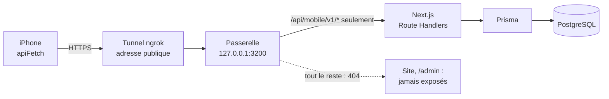
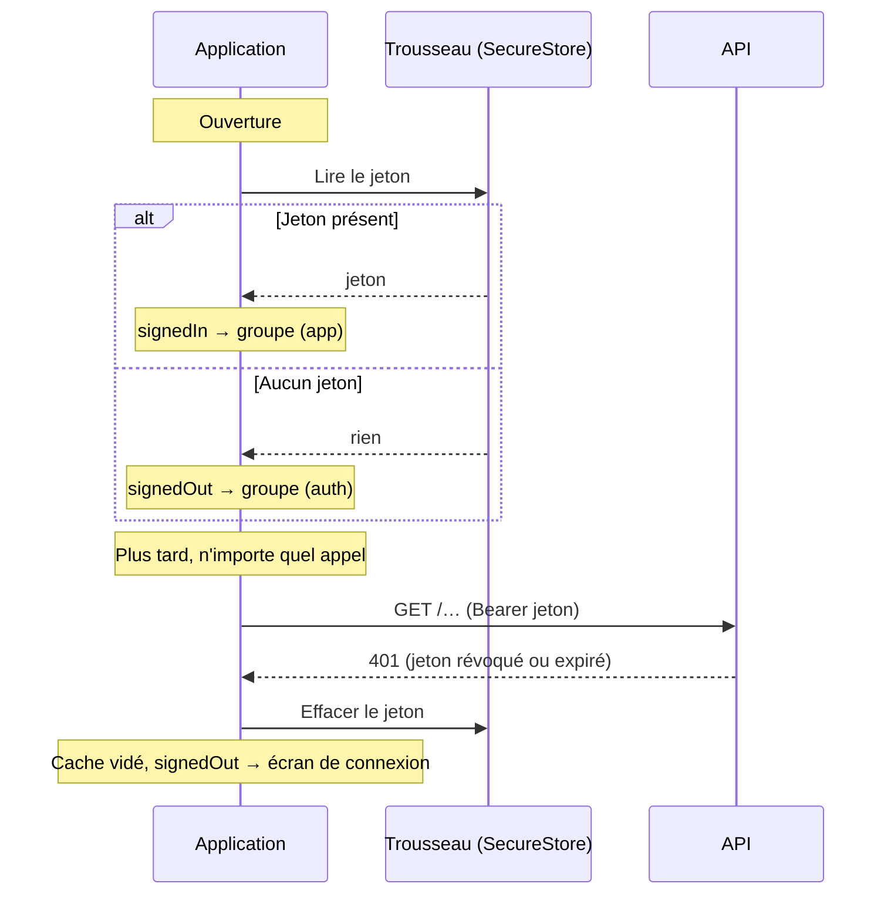

# Backend, données, session et sécurité

Ce document explique d'où viennent les données de l'application, comment elle
parle au backend, comment la session est gérée et ce qui protège les actions
importantes. Il correspond à la ligne « Backend, données réelles, auth,
sécurité » du barème.

Documents liés : [architecture](architecture.md) · [scan QR](scan-qr.md) ·
[géolocalisation](geolocalisation.md).

## Le backend : celui du projet web

L'application n'a ni base de données ni serveur à elle. Elle réutilise le
backend du projet web Repère
(<https://github.com/Benbecker69/next_js_m_deux>) : Next.js, Prisma et
PostgreSQL. Le site et l'application lisent et écrivent dans **la même base** :
une réservation faite sur le téléphone apparaît sur le site, et inversement.

Le projet web expose pour cela une API dédiée, `/api/mobile/v1`. Son contrat
complet (routes, erreurs, règles) est dans le dépôt web, `docs/api-mobile.md`.
`src/types/api.ts` en est le miroir côté application.

**Aucune donnée du parcours n'est écrite en dur.** Les espaces, les lieux, les
réservations, les crédits et l'historique viennent tous de l'API.

## Le chemin d'une requête



Le backend tourne sur mon poste, il n'est pas déployé. Un téléphone ne peut pas
joindre `localhost` : il passe par un tunnel qui donne une adresse HTTPS
publique. Le contexte (un serveur Windows en bureau à distance, des ports
bloqués) et les problèmes rencontrés sont dans
[environnement-et-reseau.md](environnement-et-reseau.md).

### La passerelle : n'exposer que l'API

`tools/api-gateway/server.js` — environ 150 lignes, sans dépendance (module `http` de
Node).

Sans elle, le tunnel pointerait sur le serveur Next.js entier : le site et son
administration seraient ouverts à tout Internet, avec des comptes de
démonstration dont le mot de passe est public. La passerelle se place entre le
tunnel et Next.js et ne laisse passer que l'API mobile.

| Contrôle                                   | Réponse sinon                |
| ------------------------------------------ | ---------------------------- |
| Chemin commençant par `/api/mobile/v1/`    | `404`                        |
| Méthode `GET`, `POST` ou `PATCH`           | `404`                        |
| Chemin sans `..`                           | `404`                        |
| Corps de 1 Mo au plus                      | `413`                        |
| Backend joignable                          | `502`                        |

Elle n'écoute que sur `127.0.0.1` : elle n'est pas joignable depuis le réseau
local, seulement par le tunnel lancé sur la même machine. Ses réponses d'erreur
ont la même forme que celles de l'API (`{ "error": { "code", "message" } }`,
message en français) : si le backend est arrêté, l'application affiche « Le
serveur est injoignable. Réessayez dans un instant. »

Vérification, passerelle lancée :

```bash
curl -s http://127.0.0.1:3200/api/mobile/v1/health            # {"status":"ok",…}
curl -s -o /dev/null -w "%{http_code}\n" http://127.0.0.1:3200/        # 404
curl -s -o /dev/null -w "%{http_code}\n" http://127.0.0.1:3200/admin   # 404
```

## Le client de l'API

`src/services/api.ts` contient la fonction `apiFetch`. C'est **le seul endroit
de l'application qui appelle `fetch`**.

| Ce que fait `apiFetch`                    | Détail                                                                             |
| ----------------------------------------- | ---------------------------------------------------------------------------------- |
| Construit l'adresse                       | `EXPO_PUBLIC_API_URL` + le chemin (`/reservations`…)                               |
| Ajoute le jeton                           | `Authorization: Bearer …`, lu dans le stockage sécurisé                            |
| Refuse sans jeton                         | Erreur `401` locale, sans appel réseau, si la route exige une session              |
| Limite l'attente                          | Abandon après 15 secondes (`AbortController`)                                      |
| Uniformise les erreurs                    | Toute erreur devient une `ApiError(status, code, message)`                         |
| Signale la session perdue                 | Sur tout `401`, appelle le gestionnaire global (voir « Session »)                  |
| Passe l'écran d'avertissement de ngrok    | En-tête `ngrok-skip-browser-warning`                                               |

Le serveur répond aux erreurs par `{ "error": { "code", "message" } }`, avec un
message en français que l'application affiche tel quel. Une panne de réseau ou
un délai dépassé donne une `ApiError` de statut `0`, avec son propre message
(« Impossible de joindre le serveur. Vérifiez votre connexion. », « Le serveur
met trop de temps à répondre. »).

Au-dessus du client, un fichier par ressource expose des fonctions qui disent ce
qu'elles font, pas des adresses :

| Service                  | Fonctions                                                                                 |
| ------------------------ | ----------------------------------------------------------------------------------------- |
| `authService.ts`         | `register`, `login`, `logout`, `me`, `updateProfile`, `changePassword`, `changeEmail`     |
| `spacesService.ts`       | `listNearbySpaces`, `getSpaceAvailability`                                                |
| `reservationsService.ts` | `listReservations`, `getReservation`, `createReservation`, `cancelReservation`            |
| `checkInsService.ts`     | `listCheckIns`, `createCheckIn`                                                           |
| `summaryService.ts`      | `getSummary`                                                                              |

## Lectures et écritures

| Lecture                                    | Route                               | Écran                               |
| ------------------------------------------ | ----------------------------------- | ----------------------------------- |
| Mon compte                                 | `GET /me`                           | Accueil, Profil, récapitulatif      |
| Mes chiffres                               | `GET /me/summary`                   | Accueil                             |
| Espaces, triés par distance                | `GET /spaces/nearby`                | Réserver, près de moi               |
| Créneaux pris d'un espace                  | `GET /spaces/{id}/availability`     | Page d'un espace                    |
| Mes réservations (par pages)               | `GET /reservations`                 | Réserver, Accueil                   |
| Une réservation                            | `GET /reservations/{id}`            | Détail                              |
| Mes tentatives d'arrivée (par pages)       | `GET /check-ins`                    | Historique                          |

| Écriture                                   | Route                                   | Ce que le serveur vérifie                                  |
| ------------------------------------------ | --------------------------------------- | ---------------------------------------------------------- |
| Créer un compte                            | `POST /auth/register`                   | Format, adresse non utilisée                               |
| Se connecter                               | `POST /auth/login`                      | Mot de passe, frein après 10 échecs en 10 minutes          |
| Se déconnecter                             | `POST /auth/logout`                     | Révoque la session                                         |
| Modifier son profil                        | `PATCH /me`                             | Format du nom, situation parmi trois valeurs               |
| Changer de mot de passe                    | `POST /me/password`                     | Mot de passe actuel                                        |
| Changer d'adresse e-mail                   | `POST /me/email`                        | Mot de passe actuel, adresse non utilisée                  |
| Réserver                                   | `POST /reservations`                    | Créneau libre, espace actif, solde suffisant (transaction) |
| Annuler                                    | `POST /reservations/{id}/cancel`        | Réservation à soi, confirmée, pas commencée                |
| Valider une arrivée                        | `POST /reservations/{id}/check-in`      | Espace, heure, précision, fraîcheur, distance              |

Les règles de l'application (heures grisées, bouton désactivé) évitent les
demandes vouées à l'échec. Elles n'autorisent rien : **chaque action importante
est validée sur le serveur**, qui reste le seul à modifier le solde, à créer une
réservation ou à valider une arrivée. Réservation, annulation et arrivée sont
des transactions : deux demandes simultanées pour le même créneau donnent une
réservation et un refus.

Chaque tentative d'arrivée laisse une trace dans la table `check_ins`
(acceptée ou refusée, distance, précision, espace scanné). Elle est relue par
`GET /check-ins` et affichée dans l'Historique.

## Session

### Le jeton

- À la connexion ou à l'inscription, le serveur renvoie un jeton opaque
  (`rpm_…`), valable 14 jours. Le serveur n'en garde que l'empreinte SHA-256.
- L'application le range dans le **trousseau d'iOS** par `expo-secure-store`
  (`src/storage/token.ts`, clé `repere_mobile_token`). Il n'est jamais écrit
  dans AsyncStorage, qui n'est pas chiffré.
- Le mot de passe n'est jamais stocké sur le téléphone.

### L'état de connexion

`src/features/auth/AuthContext.tsx` tient un état à trois valeurs :
`loading`, `signedOut`, `signedIn`.



- **À l'ouverture**, l'état se décide par une lecture locale, sans réseau :
  l'application s'ouvre tout de suite, même si le serveur est lent.
- **Erreur 401** : `apiFetch` prévient `AuthContext` par un gestionnaire
  enregistré une fois (`setUnauthorizedHandler`). Le jeton est effacé, le cache
  vidé, l'état passe à `signedOut`, et la navigation revient à la connexion.
  Aucun écran ne traite le 401 lui-même.
- **Déconnexion** : la session est révoquée sur le serveur, puis le jeton et le
  cache sont effacés. Si le réseau est coupé, l'effacement local a lieu quand
  même.
- **Session persistée** : fermer puis rouvrir l'application ne demande pas de se
  reconnecter.

J'ai rencontré un bug sur ce point en testant sur l'iPhone : une session
révoquée côté serveur n'était détectée qu'après avoir fermé complètement
l'application. TanStack Query s'appuie par défaut sur des événements du
navigateur (`window`, `navigator.onLine`) qui n'existent pas sur React Native.
Le correctif est dans `src/storage/queryClient.ts` : `focusManager` est branché
sur `AppState` et `onlineManager` sur NetInfo, pour que les données soient
revérifiées au retour au premier plan et au retour du réseau.

## Sécurité

| Sujet                                  | Ce qui est en place                                                                                      |
| -------------------------------------- | -------------------------------------------------------------------------------------------------------- |
| Clé secrète dans l'application         | Aucune. La seule variable est `EXPO_PUBLIC_API_URL`, une adresse publique. Les cartes n'ont pas de clé.  |
| Jeton de session                       | Dans le trousseau d'iOS ; envoyé seulement à l'API, en HTTPS                                             |
| Routes de l'API                        | Toutes exigent le jeton, sauf la connexion, l'inscription et `/health`                                   |
| Données d'un autre utilisateur         | Le serveur filtre par propriétaire : une réservation d'un autre compte répond `404`                      |
| Actions sensibles du compte            | Mot de passe actuel exigé pour changer d'e-mail ou de mot de passe                                       |
| Écran « Sécurité »                     | Verrouillé par Face ID ou le code de l'appareil (`useScreenLock`, `expo-local-authentication`)           |
| Changement de mot de passe             | Le serveur révoque les autres sessions                                                                   |
| Tentatives de connexion                | Frein côté serveur : 10 échecs en 10 minutes pour une adresse                                            |
| Exposition du backend                  | La passerelle ne laisse passer que `/api/mobile/v1/*`                                                    |
| Validation d'une arrivée               | Décidée par le serveur ; aucun contournement dans l'application                                          |
| Permissions du téléphone               | Position (pendant l'utilisation), caméra, Face ID : chacune demandée au moment où elle sert              |

Si l'appareil n'a ni Face ID ni code, il n'y a rien pour s'authentifier :
l'écran « Sécurité » s'ouvre sans verrou, pour ne pas bloquer définitivement
l'accès à ses propres réglages. Les formulaires exigent toujours le mot de
passe actuel.

## Cache et données hors ligne

`src/storage/queryClient.ts`

- Les réponses de l'API sont gardées par TanStack Query et **enregistrées sur le
  téléphone** (AsyncStorage) pendant 24 heures : à la réouverture, les
  dernières données connues s'affichent aussitôt, puis sont rafraîchies.
- Une donnée est considérée fraîche pendant 30 secondes : passer d'un onglet à
  l'autre ne relance pas d'appel inutile.
- Sans réseau, un bandeau « Hors ligne — les données affichées peuvent être
  obsolètes » reste affiché en haut de l'écran, et les données en cache restent
  consultables.
- À la déconnexion, le cache est vidé : le compte suivant ne voit rien du
  précédent.

Le cache contient des données du compte (réservations, profil), pas le jeton.

## Limites

- **Pas de déploiement.** Le backend tourne sur mon ordinateur et le téléphone
  l'atteint par un tunnel : l'ordinateur doit être allumé, avec le projet web,
  la passerelle et le tunnel lancés.
- **La position est déclarée par le téléphone** : voir
  [geolocalisation.md](geolocalisation.md#limites).
- **Le frein de connexion est en mémoire du serveur** : il repart de zéro quand
  le serveur redémarre.
- **L'API ne revérifie pas les heures d'ouverture** (9 h – 18 h) : c'est le
  calendrier de l'application qui ne propose que ces heures.
- **Le détail d'une arrivée est relu dans le cache de la liste**, sans appel
  dédié : si le cache a été vidé entre-temps, l'écran invite à revenir à
  l'historique.
