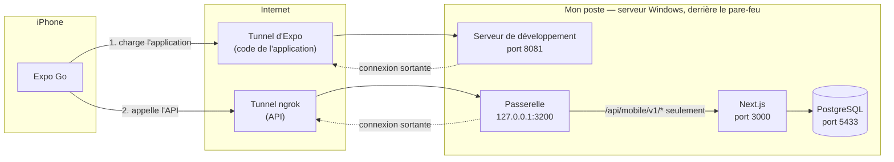

# Environnement de développement : serveur distant, ports et tunnels

Ce document explique dans quelles conditions j'ai développé et testé
l'application, les problèmes de réseau et de ports que cela a posés, et comment
je les ai contournés. Il explique pourquoi le lancement passe par deux tunnels et
une passerelle au lieu d'un simple `npx expo start`.

Documents liés : [backend et sécurité](backend-et-securite.md) ·
[README, « Lancer l'application »](../README.md#lancer-lapplication).

## Le contexte

Je ne développe pas sur un ordinateur personnel. Mon poste est un **ordinateur
de mon entreprise : un serveur Windows Server 2022 auquel j'accède en bureau à
distance (RDS)**. **Je n'y ai pas les droits d'administrateur.** Je teste sur un
vrai téléphone, un iPhone, avec Expo Go. Je n'ai pas de Mac, donc pas de
simulateur iOS.

Quatre conséquences :

| Contrainte                                              | Effet                                                                   |
| ------------------------------------------------------- | ----------------------------------------------------------------------- |
| Le poste est dans le domaine de l'entreprise, qui gère son pare-feu | L'iPhone ne peut pas ouvrir de connexion vers les ports de mon poste |
| Je n'ai pas les droits d'administrateur                 | Je ne peux pas ouvrir un port dans le pare-feu ni changer la configuration réseau |
| Le serveur héberge d'autres projets                     | Des ports habituels (3000) peuvent déjà être pris                       |
| Le backend n'est pas déployé                            | Il tourne sur ce poste : il faut pourtant que le téléphone l'atteigne   |

Le mode habituel d'Expo suppose l'inverse : un ordinateur et un téléphone sur
le même Wi-Fi, le téléphone chargeant l'application directement depuis
l'ordinateur. Ici, ce chemin est fermé. J'ai fait l'essai : depuis Safari sur
l'iPhone, l'adresse de mon poste sur le port 8081 (celui du serveur de
développement) ne répond pas.

## L'idée : ne faire que des connexions sortantes

Ce qui **entre** sur le poste est bloqué ; ce qui en **sort** passe. Un tunnel
retourne le problème : c'est mon poste qui ouvre une connexion sortante
vers un service sur Internet, et ce service donne en échange une adresse HTTPS
publique. Le téléphone parle à cette adresse ; le trafic redescend par la
connexion déjà ouverte. Aucun port n'est à ouvrir sur le serveur, et rien de ce
que j'ai mis en place ne demande les droits d'administrateur.



Il y a **deux tunnels**, parce que le téléphone a besoin de deux choses qui
tournent sur mon poste :

1. le **code de l'application**, servi par le serveur de développement d'Expo ;
2. l'**API**, servie par le projet web.

## Les problèmes rencontrés et leur solution

### 1. Le téléphone ne joint pas le serveur de développement

- **Symptôme** : en mode réseau local (`npx expo start`), Expo Go ne charge pas
  le projet.
- **Cause** : le téléphone ne peut pas se connecter au port 8081 de mon poste.
- **Solution** : `npx expo start --tunnel`. Expo fait passer le serveur de
  développement par un tunnel et affiche un QR code qui pointe vers une adresse
  publique.

### 2. Le tunnel d'Expo ne démarrait pas

- **Symptôme** : `--tunnel` a besoin du paquet `@expo/ngrok`. Expo propose de
  l'installer globalement, mais sur ce poste l'installation globale n'était
  jamais retrouvée au lancement suivant.
- **Solution** : j'ai ajouté `@expo/ngrok` aux dépendances de développement du
  projet (`devDependencies` dans `package.json`). Il est installé par
  `npm install` avec le reste, et Expo le trouve dans le projet.

### 3. Le backend est sur `localhost`

- **Symptôme** : sur un téléphone, `localhost` désigne le téléphone. L'adresse
  locale du backend ne veut rien dire pour lui, et son port n'est de toute façon
  pas joignable.
- **Solution** : un second tunnel, ngrok, qui donne une adresse HTTPS au
  backend. J'utilise le **domaine fixe** du forfait gratuit : l'adresse ne
  change pas d'un lancement à l'autre, donc `.env` non plus.

```bash
ngrok http 3200 --url https://<mon-domaine>.ngrok-free.dev
```

### 4. Un tunnel direct aurait exposé tout le site

- **Problème** : pointer le tunnel sur Next.js (port 3000) aurait rendu public
  le site entier, administration comprise, avec des comptes de démonstration
  dont le mot de passe est connu.
- **Solution** : le tunnel pointe sur une **passerelle** que j'ai écrite
  (`tools/api-gateway/server.js`, port 3200). Elle ne transmet que les chemins
  qui commencent par `/api/mobile/v1/` et répond `404` à tout le reste. Elle
  n'écoute que sur `127.0.0.1`. Détail dans
  [backend-et-securite.md](backend-et-securite.md#la-passerelle--nexposer-que-lapi).

### 5. Le port 3000 était déjà pris en IPv4

- **Symptôme** : pendant le développement, un autre serveur du poste écoutait
  sur `127.0.0.1:3000`. Mon serveur Next.js, lui, répondait sur l'adresse IPv6
  `[::1]:3000`. Appeler `http://127.0.0.1:3000` donnait la réponse de l'autre
  projet (un `404` qui ne venait pas de Next.js).
- **Solution** :
  - la passerelle vise `http://[::1]:3000` par défaut, et la variable `UPSTREAM`
    permet de viser une autre adresse sans toucher au code ;
  - côté projet web, le port publié par Docker se change avec `WEB_PORT`
    (`WEB_PORT=3100 docker compose up`), et la passerelle suit avec
    `UPSTREAM=http://127.0.0.1:3100`.
- **Réflexe** : avant de conclure qu'un serveur est cassé, vérifier **qui**
  répond sur le port (`curl -i`, en-tête `X-Powered-By`).

### 6. Les appels arrivaient à la racine du tunnel

- **Symptôme** : au premier essai de connexion sur l'iPhone, une erreur
  « introuvable », et rien dans les journaux de Next.js.
- **Cause** : `EXPO_PUBLIC_API_URL` s'arrêtait au nom de domaine. L'application
  appelait `/auth/login` à la racine ; la passerelle, qui n'accepte que
  `/api/mobile/v1/…`, répondait elle-même `404` sans rien transmettre.
- **Solution** : la variable contient le préfixe
  (`https://<domaine>/api/mobile/v1`). `.env.example` l'explique. C'est le
  commit `31475db`.

### 7. ngrok affiche une page d'avertissement

- **Symptôme** : sur un domaine gratuit, ngrok répond d'abord par une page HTML
  d'avertissement aux requêtes qui ressemblent à celles d'un navigateur. Une
  application attend du JSON.
- **Solution** : `apiFetch` envoie l'en-tête `ngrok-skip-browser-warning`,
  prévu par ngrok pour passer cette page (`src/services/api.ts`).

### 8. Le forfait gratuit a un quota de requêtes

- **Conséquence** : l'application ne doit pas multiplier les appels.
- **Solution** : pas d'interrogation périodique du serveur, une donnée reste
  fraîche 30 secondes, la recherche se fait sur la liste déjà chargée
  (`src/storage/queryClient.ts`, `src/features/spaces/search.ts`).

## Les ports utilisés

| Port   | Service                                   | Écoute sur                  | Exposé à Internet            |
| ------ | ----------------------------------------- | --------------------------- | ---------------------------- |
| 8081   | Serveur de développement d'Expo           | Le poste                    | Oui, par le tunnel d'Expo    |
| 3200   | Passerelle de l'API                       | `127.0.0.1` seulement       | Oui, par le tunnel ngrok     |
| 3000   | Next.js (site et API)                     | Le poste                    | Non : seule l'API, par la passerelle |
| 5433   | PostgreSQL (conteneur Docker)             | Le poste                    | Non                          |

Les ports de la passerelle et du site se changent sans modifier le code :
`GATEWAY_PORT`, `UPSTREAM`, `WEB_PORT`.

## Ordre de lancement

Quatre terminaux, dans cet ordre. Chaque étape se vérifie avant de passer à la
suivante.

| # | Terminal                    | Commande                                           | Vérification                                                        |
| - | --------------------------- | -------------------------------------------------- | ------------------------------------------------------------------- |
| 1 | Projet web                  | `docker compose up --build`                        | `curl http://localhost:3000/api/mobile/v1/health` → `"status":"ok"` |
| 2 | Application                 | `npm run gateway`                                  | `curl http://127.0.0.1:3200/api/mobile/v1/health` → `"status":"ok"` |
| 3 | N'importe où                | `ngrok http 3200 --url https://<domaine>`          | `curl -H "ngrok-skip-browser-warning: 1" https://<domaine>/api/mobile/v1/health` → `"status":"ok"` |
| 4 | Application                 | `npx expo start --tunnel`                          | Scanner le QR code : l'écran de connexion s'affiche                 |

## Lire une erreur

Le message affiché par l'application dit à quel étage se trouve la panne.

| Message dans l'application                                    | Qui répond            | Quoi vérifier                                             |
| ------------------------------------------------------------- | --------------------- | --------------------------------------------------------- |
| « Impossible de joindre le serveur. Vérifiez votre connexion. » | Personne              | Le réseau du téléphone, l'adresse dans `.env`             |
| « Le serveur met trop de temps à répondre. »                  | Personne, en 15 s     | Le tunnel, la charge du poste                             |
| « Erreur du serveur (…). »                                    | Autre chose que l'API | Le tunnel ngrok est-il lancé, sur le bon port ?           |
| « Ressource introuvable. »                                    | La passerelle         | Le préfixe `/api/mobile/v1` dans `.env`                   |
| « Le serveur est injoignable. Réessayez dans un instant. »    | La passerelle         | Le projet web est-il lancé ? `UPSTREAM` est-il le bon ?   |
| Un message métier (« Ce créneau vient d'être réservé… »)      | L'API                 | Rien : la chaîne fonctionne                               |

Après une modification de `.env`, relancer Expo avec `-c` : les variables
`EXPO_PUBLIC_` sont lues au démarrage.

## Sur un poste classique

Avec un ordinateur personnel et un téléphone sur le même Wi-Fi, l'étape 4
devient `npx expo start`, sans tunnel. Les étapes 2 et 3 restent nécessaires :
la passerelle n'écoute que sur `127.0.0.1`, le téléphone passe donc toujours par
le tunnel ngrok pour atteindre l'API.

## Limites

- Mon poste doit rester allumé, avec les quatre services lancés, pendant toute
  la démonstration.
- L'application dépend de deux services tiers (le tunnel d'Expo et ngrok) : si
  l'un est indisponible, le téléphone ne charge plus l'application ou ne joint
  plus l'API.
- Les échanges passent par Internet même quand le téléphone est à côté du
  poste.
