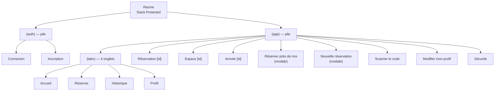

# Interface mobile, navigation, états et permissions

Ce document décrit ce qui fait de l'application une interface de téléphone : la
navigation, les états de chaque écran, les retours après une action, les
permissions et l'ergonomie au doigt. Il correspond à la ligne « UI mobile,
navigation, états, permissions » du barème.

Documents liés : [architecture](architecture.md) · [parcours mobile](parcours-mobile.md) ·
[géolocalisation](geolocalisation.md) · [scan QR](scan-qr.md).

## Navigation

- **Quatre onglets** pour les quatre choses que l'on vient faire : voir où j'en
  suis, réserver, retrouver mes arrivées, gérer mon compte.
- **Une pile** au-dessus des onglets pour les écrans de détail : le bouton
  retour d'iOS (libellé « Retour ») et le geste de balayage fonctionnent.
- **Deux fenêtres modales** pour les actions que l'on commence et que l'on
  termine. Elles ont un bouton « Fermer », en plus du balayage vers le bas.
- **Après la connexion**, l'écran de connexion n'existe plus dans la
  navigation : pas de retour possible vers lui.
- **Après une réservation**, le formulaire est remplacé par le détail de la
  réservation : le retour ramène à la liste, pas au formulaire déjà envoyé.

Le détail (fichiers, garde, routes dynamiques) est dans
[architecture.md](architecture.md#les-routes).

## Les quatre états de chaque écran

Chaque écran qui affiche des données gère le chargement, l'erreur, le vide et le
succès.

| Écran                 | Chargement               | Erreur                                    | Vide                                                       |
| --------------------- | ------------------------ | ----------------------------------------- | ---------------------------------------------------------- |
| Accueil               | `HomeSkeleton`           | Message + « Réessayer »                   | Carte « Aucune réservation à venir » + « Réserver un espace » |
| Espaces               | `ListSkeleton`           | Message + « Réessayer »                   | « Aucun espace ne correspond à « … » » + « Effacer la recherche » |
| Mes réservations      | `ListSkeleton`           | Message + « Réessayer »                   | Icône, explication et « Voir les espaces »                 |
| Historique            | `ListSkeleton`           | Message + « Réessayer »                   | « Aucune tentative d'arrivée » ; « Aucune tentative le … » avec un filtre |
| Détail d'une réservation | `DetailSkeleton`      | Message + « Réessayer »                   | —                                                          |
| Page d'un espace      | `SpaceSkeleton`          | Message + « Réessayer »                   | Heures toutes grisées si le jour est complet               |
| Réserver près de moi  | `ProposalSkeleton`       | Message + « Réessayer »                   | « Aucun espace disponible pour l'heure actuelle. »         |
| Nouvelle réservation  | Squelette de carte et de liste | Message + « Réessayer »             | « Aucun espace pour ce lieu. » + « Effacer les filtres »   |
| Profil                | `ProfileSkeleton`        | Message + « Réessayer »                   | —                                                          |
| Sécurité              | `SecurityFormSkeleton`   | Message + « Réessayer »                   | —                                                          |

### Chargement : des squelettes, pas une roue

`src/components/Skeleton.tsx` est un bloc gris qui pulse.
`src/components/skeletons.tsx` assemble ces blocs à la forme de chaque écran
(même carte, mêmes espacements) : quand les données arrivent, rien ne saute.
Pour VoiceOver, un squelette est un seul élément annoncé « Chargement en
cours ».

Une roue (`ActivityIndicator`) n'apparaît que **dans un bouton** pendant son
action, et sur l'écran de scan pendant la vérification.

### Erreur : le message du serveur et une sortie

`src/components/ScreenState.tsx` affiche le message et un bouton. Le message
vient de l'API, en français (« Ce créneau vient d'être réservé. Choisissez-en un
autre. ») ; pour une panne de réseau, c'est celui du client (« Impossible de
joindre le serveur. Vérifiez votre connexion. »).

Sur l'accueil, une erreur ne remplace l'écran que s'il n'y a rien en cache à
montrer : hors ligne avec des données déjà chargées, les derniers chiffres
restent affichés.

### Vide : dire quoi faire

Un écran vide explique la situation et, quand c'est utile, propose l'action
suivante : « Voir les espaces », « Réserver un espace », « Effacer la
recherche ».

## Retours après une action

| Retour                    | Où                                                                 | Détail                                                                    |
| ------------------------- | ------------------------------------------------------------------ | ------------------------------------------------------------------------- |
| Toast                     | Après chaque action (réserver, annuler, arrivée, profil, connexion) | Icône verte pour un succès, rouge pour une erreur ; 3 secondes ; se ferme au toucher |
| Bouton en cours           | Tous les boutons d'action                                          | Roue dans le bouton, bouton désactivé : pas de double envoi               |
| Appui visible             | Tous les éléments touchables                                       | Opacité réduite, légère réduction d'échelle sur les boutons principaux    |
| Confirmation              | Annuler une réservation, se déconnecter                            | Alerte native d'iOS avec un bouton destructif                             |
| Tirer pour rafraîchir     | Accueil, Espaces, Mes réservations, Historique                     | La roue ne s'affiche que sur un vrai geste, pas sur un rafraîchissement en arrière-plan |
| Message sous le formulaire | Connexion, inscription, réservation, arrivée                      | Reste lisible plus longtemps qu'un toast                                  |
| Bandeau hors ligne        | Tous les écrans connectés                                          | « Hors ligne — les données affichées peuvent être obsolètes »             |

Le toast est monté une seule fois, à la racine, à côté de la navigation
(`src/components/ToastHost.tsx`) : un toast lancé juste avant un changement
d'écran reste visible sur l'écran suivant.

## Permissions

Deux permissions, chacune demandée **au moment où elle sert**, avec une
explication, et avec une issue en cas de refus.

| Permission  | Demandée quand                                             | Explication avant                                              | En cas de refus                                                      |
| ----------- | ---------------------------------------------------------- | -------------------------------------------------------------- | -------------------------------------------------------------------- |
| Position    | « Autoriser la localisation », « Réserver près de moi », validation d'une arrivée | Encadré dans l'onglet Réserver, message sur les cartes | Liste alphabétique, carte grisée, réservation possible ; « Ouvrir les réglages » |
| Caméra      | Ouverture de l'écran de scan                               | Écran qui explique l'usage, bouton « Autoriser l'appareil photo » | « Ouvrir les réglages », retour à la réservation, « Valider sans scanner » |

L'écran « Sécurité » ne demande pas de permission : à son ouverture, iOS
demande le code de l'appareil. Si la saisie est annulée, l'écran « Accès
verrouillé » propose « Réessayer » et « Retour ».

Aucune permission n'est demandée au lancement. Les textes affichés par iOS sont
dans `app.json`. Le détail par permission est dans
[geolocalisation.md](geolocalisation.md#quand-la-permission-est-refusée) et
[scan-qr.md](scan-qr.md#5-les-cas-derreur).

## Ergonomie au doigt

- **Zones tactiles.** Les boutons, les onglets du sélecteur et les filtres ont
  une hauteur minimale de 44 à 52 pt (`minHeight` dans les styles) ; le bouton
  rond « + » fait 58 pt, les jours du calendrier et ses flèches 44 pt.
- **Zones sûres.** `SafeAreaProvider` à la racine, `SafeAreaView` sur chaque
  écran avec les bords utiles (`edges`), et les marges de l'encoche prises en
  compte pour les toasts et le bandeau hors ligne.
- **Clavier.** `KeyboardAvoidingView` sur la connexion, l'inscription et la
  sécurité ; un toucher sur un bouton fonctionne clavier ouvert
  (`keyboardShouldPersistTaps="handled"`) ; faire défiler une liste ferme le
  clavier de la recherche.
- **Champs.** Clavier e-mail, pas de majuscule ni de correction automatique sur
  l'e-mail, remplissage automatique d'iOS (`textContentType`, `autoComplete`),
  bouton afficher / masquer sur les mots de passe.
- **Pas de survol.** Aucune information ne dépend d'un survol ; tout passe par
  un toucher.
- **Orientation.** Portrait (`app.json`).

## Identité visuelle

- **Même palette que le site** : `src/theme/colors.ts` reprend les couleurs du
  fichier `globals.css` du projet web (encre, vert sapin, ocre, rouge).
- **Clair et sombre** : `useColors()` suit le réglage du téléphone
  (`userInterfaceStyle: "automatic"`). Les cartes suivent aussi.
- **Typographie** : titres en Fraunces, comme sur le site ; texte courant dans
  la police du système.
- **Icônes** : SF Symbols (`expo-symbols`), les icônes d'iOS.
- **Couleur et sens** : le vert pour ce qui est libre ou validé, l'ocre pour
  « pas encore » (occupé, trop tôt), le rouge pour un refus et pour un coût
  (« -6 crédits »).
- **Mouvement** : une seule animation d'entrée, sur le logo de la connexion ; le
  toast qui descend ; le squelette qui pulse. Toutes avec l'API `Animated` de
  React Native, sur le fil natif.

## Accessibilité

- Les éléments touchables ont un rôle (`accessibilityRole="button"`, `"tab"`,
  `"alert"`).
- Les boutons qui n'ont qu'une icône ont un libellé (« Fermer », « Mois
  suivant », « Effacer le filtre », « Afficher le mot de passe »).
- L'état est annoncé : onglet sélectionné, heure choisie, bouton désactivé
  (`accessibilityState`).
- Les jours du calendrier sont lus en entier : « lundi 28 septembre ».
- Les chiffres de l'accueil sont regroupés par bloc : « Présence : 80 %, 4
  arrivées sur 5 ».
- Les erreurs de formulaire ont le rôle `alert`.

## Listes

- `FlatList` et `SectionList` pour toutes les listes qui peuvent grandir.
- Réservations et historique : chargement par pages de 20 (curseur), la page
  suivante est demandée à l'approche de la fin de liste.
- En-têtes de jour collants dans Mes réservations et l'Historique.
