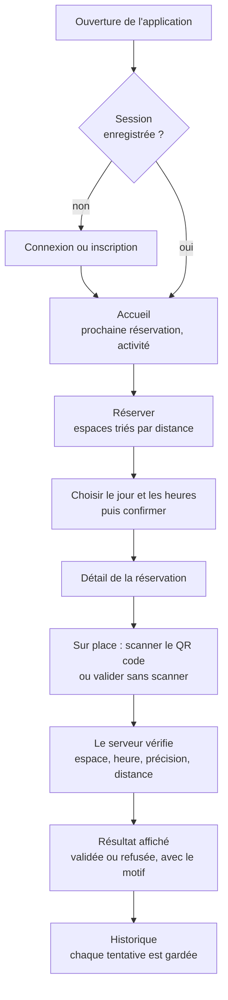

# Parcours mobile et fonctionnalités

Ce document décrit ce que l'application permet de faire, écran par écran, et
pourquoi elle existe à côté du site. Il correspond à la ligne « Parcours mobile
et valeur d'usage » du barème.

Documents liés : [architecture](architecture.md) · [scan QR](scan-qr.md) ·
[géolocalisation](geolocalisation.md) · [interface et états](interface-et-etats.md).

## Pourquoi une application, alors que le site existe

Repère est une plateforme de réservation d'espaces de coworking. Le site sert à
découvrir les lieux, gérer son compte et administrer la plateforme. L'application
sert au moment où l'on se déplace : trouver un espace près de soi, le réserver
en quelques gestes, et prouver sur place que l'on est bien arrivé.

| Ce que le téléphone apporte          | Dans l'application                                                                             |
| ------------------------------------ | ---------------------------------------------------------------------------------------------- |
| Il sait où je suis                   | Espaces triés par distance, « Réserver près de moi », validation de l'arrivée dans un rayon de 150 m |
| Il a une caméra                      | Scan du QR code collé sur l'espace : il confirme **quel** espace, en plus du lieu              |
| Il est dans ma poche                 | La prochaine réservation dès l'ouverture, les dernières données affichées même sans réseau     |
| Il reconnaît son propriétaire        | L'écran « Sécurité » s'ouvre après Face ID ou le code de l'appareil                            |
| Il a un stockage chiffré             | Le jeton de session est dans le trousseau d'iOS                                                |

Ce que l'application ne refait pas, volontairement : la page d'accueil publique,
les pages de présentation, l'administration (lieux, espaces, utilisateurs). Ces
parties restent sur le site.

## Le parcours de bout en bout

Chaque étape lit ou écrit dans la base du projet web, par l'API. Aucune donnée
du parcours n'est écrite en dur dans l'application.

## Écran par écran

### Connexion et inscription

- Connexion par e-mail et mot de passe. Le bouton « Compte de démonstration »
  remplit les deux champs ; il reste à appuyer sur « Se connecter ».
- Inscription avec nom, e-mail et mot de passe (8 caractères minimum). Le compte
  créé reçoit 20 crédits, comme sur le site.
- Une erreur (mauvais mot de passe, adresse déjà utilisée, trop de tentatives)
  s'affiche sous le formulaire et dans un toast, avec le message du serveur.
- Après la connexion, l'application bascule sur l'accueil et l'écran de
  connexion disparaît de l'historique de navigation.

Fichiers : `src/app/(auth)/index.tsx`, `src/app/(auth)/register.tsx`,
`src/features/auth/AuthContext.tsx`.

### Accueil

Ce que je vois en ouvrant l'application, de haut en bas :

1. « Bonjour Camille » (ou « Bonsoir » après 18 h) et la date du jour.
2. La **prochaine réservation**, avec le temps restant : « En cours »,
   « Dans 35 min », « Dans 3 h », « Demain », « Dans 4 jours ». Sans réservation,
   une carte invite à en créer une.
3. Trois raccourcis : « Trouver un espace », « Nouvelle réservation »,
   « Mes arrivées ».
4. « Votre activité » : le solde de crédits, le nombre de réservations à venir,
   les heures réservées et les crédits dépensés sur les 30 derniers jours, le
   taux de présence (arrivées validées sur réservations terminées) et le lieu
   favori.
5. « Ensuite » : les réservations suivantes, avec un lien « Tout voir ».

Les chiffres sont calculés par le serveur (`GET /me/summary`) : l'application
ne charge ses listes que page par page, les compter sur le téléphone serait
faux.

Fichiers : `src/app/(app)/(tabs)/index.tsx`,
`src/features/home/useHomeDashboard.ts`, `src/features/home/insights.ts`.

### Réserver

Un seul onglet pour tout ce qui concerne la réservation, en deux moitiés.

**Espaces**

- La carte « Réserver près de moi » : un geste pour obtenir l'espace libre le
  plus proche (voir plus bas).
- La liste de tous les espaces : nom, lieu et ville, capacité, prix par heure,
  distance, et une pastille « Libre maintenant » ou « Occupé maintenant ».
- Triée par distance quand la position est connue, par ordre alphabétique sinon.
- Une barre de recherche filtre par nom d'espace, de lieu ou de ville, sans
  tenir compte des accents ni des majuscules (« ampere » trouve
  « Salle Ampère »). La recherche se fait sur la liste déjà chargée : aucun appel
  réseau par lettre tapée.

**Mes réservations**

- Trois filtres : « À venir », « Passées », « Toutes ».
- La prochaine réservation est mise en avant ; les autres sont regroupées par
  jour (« Aujourd'hui », « Demain », « lun. 28 sept. »).
- La liste se charge par pages de 20, au fil du défilement.

Le bouton rond « + » ouvre « Nouvelle réservation » depuis les deux moitiés.

Fichiers : `src/app/(app)/(tabs)/book.tsx`, `src/components/SpacesPane.tsx`,
`src/components/ReservationsPane.tsx`.

### Page d'un espace : choisir le créneau

- Le nom, le lieu, l'adresse, le prix par heure et la capacité.
- Une carte du lieu et un bouton « Itinéraire » qui ouvre Plans.
- Un **calendrier mensuel** : d'aujourd'hui au même jour du mois suivant.
- L'**heure de début** (9 h à 17 h) puis l'**heure de fin** (jusqu'à 18 h) : une
  réservation peut durer plusieurs heures. Les heures passées ou déjà prises
  sont grisées.
- Le récapitulatif avant de confirmer : solde, coût (en rouge, « -6 crédits »),
  solde après réservation. Si le solde ne suffit pas, le bouton est désactivé et
  la raison est écrite.
- « Confirmer la réservation » : le serveur vérifie de nouveau le créneau et le
  solde. En cas de succès, l'écran est remplacé par le détail de la réservation.

Fichiers : `src/app/(app)/space/[id].tsx`,
`src/features/booking/useBookingForm.ts`, `src/features/booking/slots.ts`,
`src/components/SlotPicker.tsx`, `src/components/BookingConfirmation.tsx`.

### Réserver près de moi

Fenêtre ouverte par la carte du même nom. L'application lit ma position une
fois, demande au serveur l'espace **libre maintenant** le plus proche, et
l'affiche avec sa distance. La première heure encore réservable est déjà
sélectionnée : ouvrir, vérifier, confirmer. Le jour et les heures restent
modifiables.

Fichier : `src/app/(app)/reserve.tsx`.

### Nouvelle réservation

Fenêtre en deux étapes sur un seul écran.

1. **Choisir un espace** : recherche, liste alphabétique et carte des lieux.
   Toucher un repère de la carte ne garde que les espaces de ce lieu.
2. **Choisir le jour et les heures** : le même calendrier et le même
   récapitulatif que sur la page d'un espace. « Changer » revient à l'étape 1.

Fichier : `src/app/(app)/new-reservation.tsx`.

### Détail d'une réservation

- La carte de tête : type d'espace, jour, heures, espace, lieu, adresse, coût.
- La carte **Arrivée**, qui change selon le moment :

| État           | Ce qui s'affiche                                                                          |
| -------------- | ----------------------------------------------------------------------------------------- |
| Trop tôt       | La fenêtre d'arrivée, et « Vérifier l'espace par QR » (ne valide rien)                    |
| Disponible     | « Scanner le code de l'espace » et « Valider sans scanner »                               |
| Validée        | « Arrivée déjà validée » et sa date                                                       |
| Fenêtre passée | « La fenêtre d'arrivée est terminée »                                                     |

- « Annuler la réservation », tant qu'elle n'a pas commencé : une confirmation
  est demandée, puis les crédits sont remboursés. Le serveur refuse aussi
  l'annulation si l'arrivée a déjà été validée.

Fichier : `src/app/(app)/reservation/[id].tsx`. Le scan et la validation sont
détaillés dans [scan-qr.md](scan-qr.md) et [geolocalisation.md](geolocalisation.md).

### Historique

- **Chaque tentative d'arrivée** est listée, acceptée ou refusée : heure,
  espace, lieu, distance mesurée, et le résultat (« Arrivée validée »,
  « Trop loin », « Trop tôt », « Mauvais espace scanné »…).
- Regroupement par jour et filtre par date avec un calendrier.
- Toucher une ligne ouvre le détail : créneau réservé, distance du lieu,
  précision du GPS, et « QR + GPS » si l'arrivée a été confirmée par un scan.

Fichiers : `src/app/(app)/(tabs)/history.tsx`, `src/app/(app)/check-in/[id].tsx`,
`src/features/checkins/grouping.ts`.

### Profil

- Le résumé du compte : nom, e-mail, solde.
- **Modifier mon profil** : prénom, nom, et situation (freelance, entreprise,
  étudiant). C'est la même ligne en base que sur le site : une modification
  faite ici se voit là-bas.
- **Sécurité** : l'écran demande Face ID ou le code de l'appareil avant de
  s'ouvrir. Il permet de changer d'adresse e-mail et de mot de passe ; les deux
  demandent le mot de passe actuel. Changer de mot de passe déconnecte les
  autres appareils.
- **Se déconnecter**, après confirmation : la session est révoquée sur le
  serveur, le jeton et le cache sont effacés du téléphone.

Fichiers : `src/app/(app)/(tabs)/profile.tsx`, `src/app/(app)/profile-edit.tsx`,
`src/app/(app)/security.tsx`, `src/features/auth/useScreenLock.ts`.

## Les règles appliquées

L'application reprend les règles du serveur pour ne pas proposer ce qui serait
refusé. Elle ne décide jamais à sa place : chaque action est revérifiée côté
serveur.

| Règle                                                     | Dans l'application                     | Sur le serveur                          |
| --------------------------------------------------------- | -------------------------------------- | --------------------------------------- |
| Créneaux par heures entières, de 9 h à 18 h               | `src/features/booking/slots.ts`        | Appliquée par le calendrier de l'app    |
| Réservation d'aujourd'hui à un mois                       | `maxBookingDate`                       | Refus au-delà de 32 jours               |
| Un créneau déjà commencé ne se réserve pas                | `isSlotPast`                           | Refus (5 minutes de tolérance)          |
| Un créneau déjà pris ne se réserve pas                    | `isSlotTaken`                          | Refus, dans une transaction             |
| Coût = prix par heure × nombre d'heures                   | `rangeCost`                            | Même formule, débit conditionnel        |
| Annulation seulement avant le début                       | `canCancelReservation`                 | Refus après le début                    |
| Arrivée : 15 min avant le début → fin, à 150 m ou moins   | Affichage de la fenêtre                | Seul juge (voir géolocalisation)        |

Les règles côté serveur sont décrites dans le dépôt du projet web,
`docs/api-mobile.md`, section « Règles métier ».
