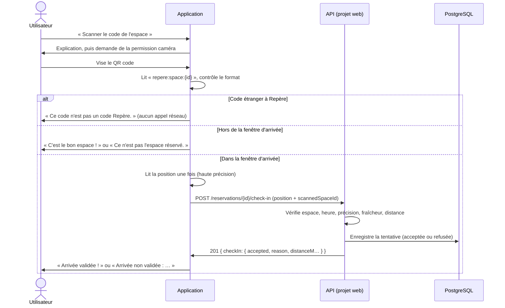

# Scan du QR code

Ce document explique à quoi sert le scan dans l'application, comment il
fonctionne du code scanné jusqu'à la base de données, et comment le tester. Il
correspond à la ligne « Scan QR code fonctionnel et pertinent » du barème.

Documents liés : [géolocalisation](geolocalisation.md) ·
[backend et sécurité](backend-et-securite.md) · [parcours mobile](parcours-mobile.md).

## À quoi sert le scan

Dans la base, un **lieu** a des coordonnées GPS, mais un **espace** (un bureau,
une salle de réunion dans ce lieu) n'en a pas. La géolocalisation peut donc
prouver que je suis dans le bon bâtiment, jamais que je suis dans la bonne salle :
deux espaces d'un même lieu sont au même point sur la carte.

Un QR code collé sur chaque espace règle ce point. Le scan répond à la question
« est-ce bien **cet** espace que j'ai réservé ? ». Il s'ajoute à la position, il
ne la remplace pas : scanner le bon code depuis chez soi ne valide rien.

Le QR code **n'ouvre pas une adresse web**. Il contient un identifiant que
l'application lit, contrôle, puis envoie au serveur avec la position ; c'est le
serveur qui valide l'arrivée.

## Le flux complet



| Étape attendue par le sujet | Dans le projet                                                                                     |
| --------------------------- | -------------------------------------------------------------------------------------------------- |
| QR code physique            | Un code par espace, généré par la page `/qrcode` du site (administrateur)                          |
| Caméra                      | `CameraView` d'`expo-camera`, caméra arrière, lecture limitée au type `qr`                         |
| Scan                        | `onBarcodeScanned` dans `src/app/(app)/scan-space.tsx`                                             |
| Payload ou identifiant      | `repere:space:{identifiant de l'espace}`                                                           |
| Validation dans l'app       | `parseSpaceQrPayload` (`src/features/checkins/qr.ts`), testée dans `__tests__/qr.test.ts`          |
| Backend                     | `POST /reservations/{id}/check-in` avec `scannedSpaceId`                                           |
| Action métier               | L'arrivée est validée ; la tentative est enregistrée dans la table `check_ins`                     |
| Retour à l'utilisateur      | Toast, mise à jour de la carte « Arrivée », ligne dans l'historique (« Vérifié par QR »)           |

## Dans le code

### 1. Lire et contrôler le code

```ts
// src/features/checkins/qr.ts
const SPACE_QR_PREFIX = "repere:space:";

export function parseSpaceQrPayload(data: string): string | null {
  if (!data.startsWith(SPACE_QR_PREFIX)) return null;
  const id = data.slice(SPACE_QR_PREFIX.length).trim();
  return id.length > 0 ? id : null;
}
```

La fonction est pure : elle reçoit le texte lu et renvoie l'identifiant de
l'espace, ou `null`. Un code Wi-Fi, un code-barres de produit ou une adresse web
est rejeté tout de suite, **avant tout appel réseau**. Le préfixe est le même
que celui de la page `/qrcode` du site : les deux doivent rester identiques.

### 2. Éviter le double scan

La caméra appelle `onBarcodeScanned` plusieurs fois par seconde tant que le code
reste dans l'image. Sans protection, un seul scan enverrait plusieurs demandes.

- `isHandlingRef` (une référence, pas un état) passe à `true` dès qu'un code est
  pris en charge : les appels suivants sont ignorés.
- Pendant la lecture de la position et l'appel au serveur, la caméra est mise
  en pause (`active={!isBusy}`) et un voile avec un indicateur recouvre l'image.
- Pour un code refusé sur place (étranger, mauvais espace), le scan reprend
  après 1,5 seconde, le temps de lire le message.

### 3. Deux usages selon le moment

Le scan ne fait pas la même chose avant et pendant la fenêtre d'arrivée
(de 15 minutes avant le début jusqu'à la fin de la réservation).

| Moment              | Bouton sur la réservation        | Effet du scan                                                                   |
| ------------------- | -------------------------------- | ------------------------------------------------------------------------------- |
| Avant la fenêtre    | « Vérifier l'espace par QR »     | Comparaison locale avec l'espace réservé. Rien n'est envoyé, rien n'est enregistré. |
| Pendant la fenêtre  | « Scanner le code de l'espace »  | Position lue, envoi au serveur, arrivée validée ou refusée, tentative enregistrée. |

C'est une règle que j'ai voulue : scanner à 11 h pour vérifier la salle d'une
réservation de midi ne doit pas compter comme une arrivée. La personne peut
repartir déjeuner ; à 11 h 05 sa réservation doit toujours dire « Trop tôt ».

### 4. Le serveur décide

Pendant la fenêtre, l'application envoie :

```json
{
  "lat": 45.7605,
  "lng": 4.8607,
  "accuracyM": 12,
  "capturedAt": "2026-10-07T12:01:30.000Z",
  "scannedSpaceId": "…"
}
```

Le serveur compare d'abord `scannedSpaceId` à l'espace réservé : s'il diffère,
c'est un refus immédiat (`WRONG_SPACE`), avant même de regarder l'heure ou la
distance. Il applique ensuite les règles de la géolocalisation (heure,
précision, fraîcheur de la position, distance). Le résultat revient dans
`checkIn.accepted` et `checkIn.reason`.

L'application ne peut pas passer outre : il n'existe pas de bouton « valider
quand même ».

### 5. Les cas d'erreur

| Situation                                   | Ce que l'utilisateur voit                                                     |
| ------------------------------------------- | ----------------------------------------------------------------------------- |
| Permission caméra pas encore demandée       | Un écran qui explique l'usage, avec « Autoriser l'appareil photo »            |
| Permission caméra refusée définitivement    | Le même écran avec « Ouvrir les réglages », et « Revenir à la réservation »   |
| Code qui n'est pas un code Repère           | « Ce code n'est pas un code Repère. », le scan reprend                        |
| Code d'un autre espace, avant la fenêtre    | « Ce n'est pas l'espace réservé. », le scan reprend                           |
| Code d'un autre espace, pendant la fenêtre  | « Arrivée non validée : Mauvais espace scanné. » (tentative enregistrée)      |
| Position indisponible ou refusée            | « Localisation indisponible — vérifiez qu'elle est autorisée… »               |
| Trop loin, trop tôt, position imprécise     | « Arrivée non validée : Trop loin. » (ou le motif correspondant)              |
| Arrivée déjà validée                        | Le message du serveur (`409 ALREADY_CHECKED_IN`)                              |
| Réseau coupé ou serveur injoignable         | « Impossible de joindre le serveur. Vérifiez votre connexion. »               |
| Réservation introuvable                     | « Réservation introuvable », avec un bouton « Retour »                        |

La permission caméra n'est demandée qu'à l'ouverture de cet écran, jamais au
lancement de l'application. Le texte affiché par iOS est défini dans
`app.json` : « Repère utilise l'appareil photo pour scanner le code d'un espace
et confirmer votre arrivée. » Le micro n'est pas demandé.

Celui qui refuse la caméra n'est pas bloqué : « Valider sans scanner » valide
l'arrivée par la position seule.

## Tester le scan

### Préparer

1. Lancer le projet web et l'application (voir le [README](../README.md),
   « Lancer l'application »).
2. Sur l'ordinateur, ouvrir le site, se connecter avec `admin@example.com` /
   `demo1234`, puis ouvrir `/qrcode` : un QR code par espace, classés par lieu.
3. Sur le téléphone, se connecter avec `camille@example.com` / `demo1234`.

### Scénario A — code étranger (aucune réservation particulière)

1. Ouvrir une réservation à venir, puis « Vérifier l'espace par QR » ou
   « Scanner le code de l'espace ».
2. Viser n'importe quel QR code qui ne vient pas de `/qrcode`.
3. Résultat attendu : « Ce code n'est pas un code Repère. » ; rien n'apparaît
   dans l'historique.

### Scénario B — vérifier l'espace avant l'heure

1. Réserver un espace pour le lendemain.
2. Ouvrir la réservation : la carte « Arrivée » indique « Trop tôt ».
3. « Vérifier l'espace par QR », puis viser sur `/qrcode` le code **du même
   espace** : « C'est le bon espace ! ».
4. Recommencer avec le code **d'un autre espace** : « Ce n'est pas l'espace
   réservé. ».
5. Résultat attendu : rien n'apparaît dans l'historique, la réservation dit
   toujours « Trop tôt ».

### Scénario C — valider l'arrivée par le scan

Il faut être dans la fenêtre d'arrivée : réserver un créneau qui commence dans
moins de 15 minutes (par exemple à 13 h 50, réserver 14 h – 15 h).

1. Ouvrir la réservation : la carte « Arrivée » propose « Scanner le code de
   l'espace ».
2. Viser le code **d'un autre espace** : « Arrivée non validée : Mauvais espace
   scanné. ».
3. Viser le code **du bon espace**. Le résultat dépend alors de la position :
   - à moins de 150 m du lieu : « Arrivée validée ! », et l'historique affiche
     « Vérifié par QR » ;
   - plus loin : « Arrivée non validée : Trop loin. ».
4. Dans l'onglet Historique, chaque tentative est listée avec sa distance.

Loin des lieux de démonstration (Lyon, Nantes, Bordeaux, Lille), le refus
« Trop loin » est le résultat normal. Pour obtenir une arrivée validée,
[créer un lieu à ses propres coordonnées](geolocalisation.md#obtenir-une-arrivée-validée).

## Limites

- Le QR code est statique : il contient l'identifiant de l'espace, pas un jeton
  à durée limitée. Une photo du code permet de le scanner ailleurs ; c'est la
  position, vérifiée par le serveur, qui empêche d'en tirer une arrivée validée.
- Le scan confirme l'espace, pas l'identité : c'est la session qui identifie
  l'utilisateur.
- Le scan a besoin de la caméra d'un vrai téléphone : il ne se teste pas dans un
  navigateur.
